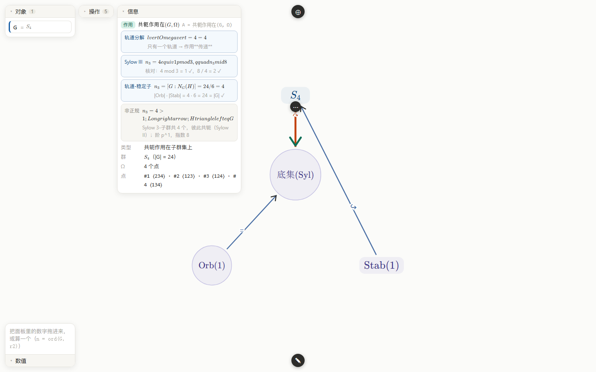
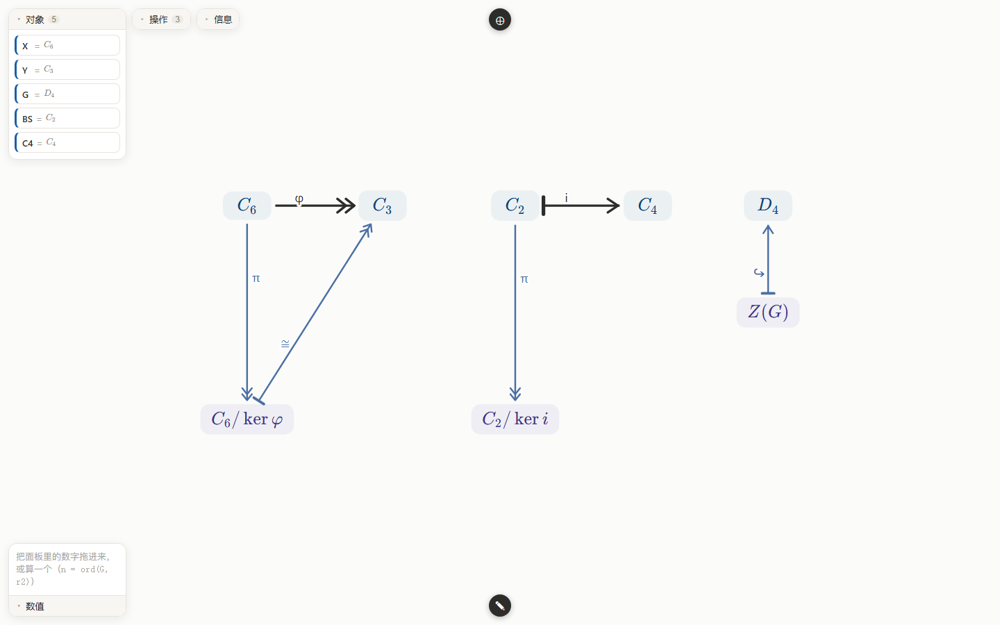
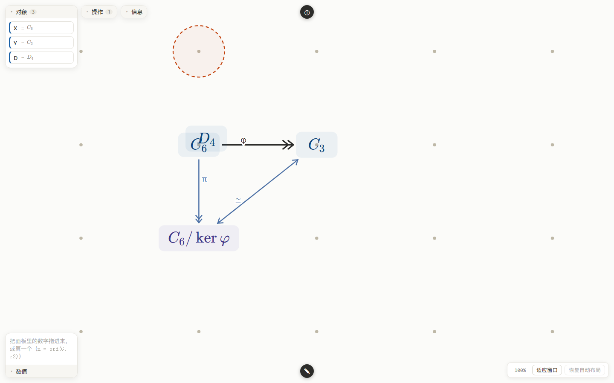
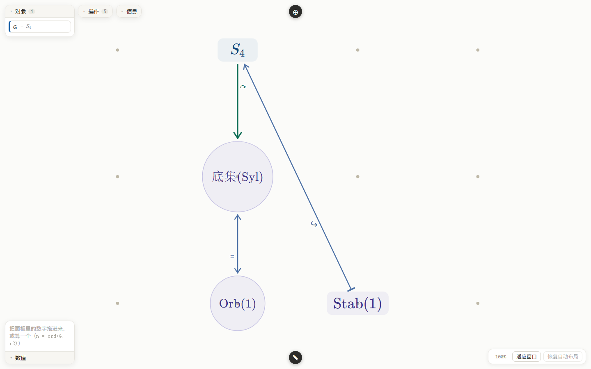
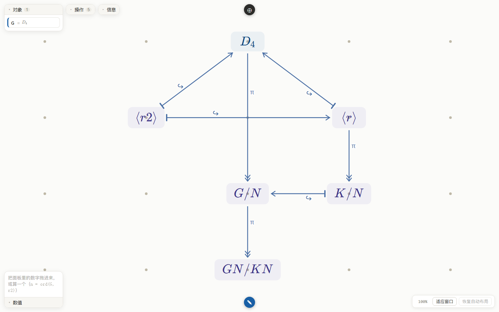
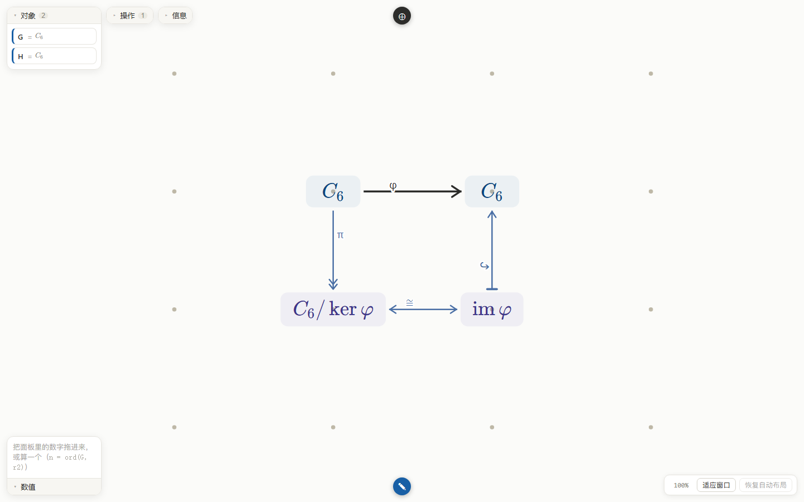

# Galculator — 群论计算器

> 交互式「计算 + 证明可见化」工具。对标 Desmos / GeoGebra 的成熟度，填补群论领域缺失的"计算器"。


_（M0.5 截图：`G = D_4` → `Z(G)` / `G / Z` / `Sub(G)` / `共轭作用(G)` → `轨道(A, r)`，画布自动派生交换图）_

## 为什么做

- Desmos / GeoGebra 擅长实函数与几何，但市面上**没有群论计算器**。
- 群论抽象、难入门；Sylow 定理等证明人人会背，却没人真正"看见"论证如何展开。

## 定位

- **证明可见化器**：演示性证明（模板人工写、机器在具体群上实例化 + 可视化），非形式化证明。
- MVP：**通过群作用证明 Sylow 定理**（I / II / III 三份模板）。
- 三档参照：

| 参照 | 借什么 |
|---|---|
| **Desmos / GeoGebra** | 交互即时反馈（目标体验）。但画布角色相反：它们是**输出**，本项目的画布是**操作台** |
| **Group Explorer** | 群论可视化约定（Cayley 图 / 群作用）|
| **Lean / Coq** | —— **明确不碰**。形式化是另一个宇宙的工程 |

## 技术栈

| 层 | 选型 |
|---|---|
| 前端 | React 19 + TypeScript + Vite（pnpm monorepo，`apps/web`）|
| 引擎 | `@groupviz/core` + `@groupviz/react` **v2.3.0**（npm 包，零 alias）|
| 证明引擎 | Proof Spec（自研，见 [docs/PROOF_SPEC.md](docs/PROOF_SPEC.md)）|
| 计算后端 | GAP（**推迟接入**；`@groupviz/core` 已含 Sylow I 全部原语，小群前端即够）|
| 数学渲染 | KaTeX |

## 快速开始

```bash
pnpm install
pnpm dev          # → http://127.0.0.1:5273
```

在**画面正下方中央的 `✎` 输入球**里输入一行定义（点球弹出输入卡片），画布自动长出节点。
**输入框是两块**——名字留空即**自动命名**（`A B D F …`，避开注册表的 83 个调用名），
表达式栏**边打边校验**：合法当场显示"会产出什么"，非法红字 + 定向提示。

**画布铺满窗口，面板浮在它上面，收展不动画布**：左上并排三个可收起的抽屉——「对象」/「操作」（运算产生的对象）/「信息」，
左下是「数值」上拉抽屉；抽屉与节点偶发重叠时收起即可。

**画布是一张无限延伸的网格**：格点像坐标纸一样**铺满整个画布**（pan / zoom 到多远都有），
对象只停在这些点上——自动布局的行列中心**量化到网格线**（顺手把列宽差拉平成等距），
拖动则**吸附到最近的空格点**（见 [DIAGRAM_SPEC §1.1](docs/DIAGRAM_SPEC.md)；格点看得见，规范才成立）。
**滚轮缩放、空白处拖动平移**，右下角工具条常驻显示缩放百分比，双击空白 / 「适应窗口」回到自动排布。

**节点可以拖**：拖动时显示**吸附预览环**，松手吸附到**最近的空格点**（已被占住的格点会自动跳过，
免得两个节点叠一起），边跟着自动重画；拖过的节点被**钉住**——布局照常算、只覆盖它自己的位置，
所以**别的节点不会跟着跳**。「恢复自动布局 · n」一键清空手动摆放。位置存在浏览器里，刷新还在。

**操作就在对象旁边**：点画布上的节点 → 左上角冒出一颗**深色悬浮球** → 环绕 4 个按钮：

| 按钮 | 行为 |
|---|---|
| 基本 / 元素 / 子群 | 切左上的**信息面板**（「元素」是表格：**行 = 元素、列 = 属性**）|
| 操作 | 展开下拉面板列出全部**单对象操作**，**点一下就建对象**（名字自动取）|

**多对象操作**（`G×H` `G/N` `A∩B` `C_G`…）不在节点上——它们不依赖"你选中了谁"，所以挂在**显示区正上方那颗球**里。

点出来的操作会被**编回一行文本**再交给同一个求值器——所以「操作」抽屉里会真的多出一行（可读可改），
且"点出来的"与"打出来的"行为必然一致。**数字可以拖**：元素表里的「阶」「中心化子」等格子直接拖进左下数值区。

菜单内容来自注册表（[`src/gal/ops.ts`](apps/web/src/gal/ops.ts)，27 条，按机制分组），每条声明**命名参数 + 类型**；
`opsFor(selection)` 据此派生出"选中什么能做什么"。文本入口照旧可用，下表是全部可写的记法：

| 输入 | 机制 | 产物 |
|---|---|---|
| `G = D_4` | 记号建群 | 群节点（方，蓝）|
| `P = G x H` · `Q = G / Z` | 原子构造（直积 / 商群）| 群节点（方，紫）|
| `A = 共轭作用(G)` | 原子构造（作用）| 作用节点（绿虚线方）+ **作用线** |
| `Z = Z(G)` · `Cg = [G,G]` · `N_G(G, H)` | 作用导出（子群）| **群节点（方，紫）**——子群升级为真群对象，故 `Z(Z(G))` 合法 |
| `I = A ∩ B` · `A ∪ B` · `A \ B` · `A · B` | 原子构造（集合运算）| 集合节点（圆，紫，不自动升级为群）|
| `K = ⟨S⟩` · `⟨G, r2⟩` | 迭代（闭包）| **群节点（方，紫）**|
| `f = 映射(G, H, r→0, s→0)` | 原子构造（同态）| **实线箭头** `G → H`（不占节点、**箭头可点选**）：点箭头 → 环绕出 `ker` / `im`，一步即建对象 |
| `ker(f)` · `im(f)` | 作用导出（映射侧）| 群节点（方，紫）· 母群是映射的端群 |
| `A = 共轭作用在(G, Ω)` | 原子构造（作用）| **作用线** `G ↷ Ω`（不占节点、**可点选**）：点它 → 环绕出 `轨道` / `稳定子` |
| `O = 轨道(A, r)` · `St = 稳定子(A, r)` · `Fix(A)` | 作用导出（原语）| 集合节点（圆，紫）|
| `S = Sub(G)` · `pSub(G, 2)` · `Syl(G, 2)` | 枚举 + 筛 | **子群集**节点（圆，紫）|
| `n = ord(G, (123))` · `C(12, 4)` · `Cmod(12, 4, 2)` | 属性 / 算术 | **数值**（左栏「数值」区，不上画布）|

元素参数一律走 core 的 `resolveElement`——`id` / `label` / **循环记号**都能命中，所以 `ord(S_4, (123))` 合法。

**交换图上的箭头是操作长出来的**：`Q = G / Z` 自动带一条 `G ↠(π) Q`；
`P = G × C₂` 带 `P ↠(π₁) G`、`P ↠(π₂) C₂`；`Z(G)` 带 `Z ↪ G`；映射对象画 `G →(f) H`。
有伴生箭头的对象不再画来源线（否则同一对节点上叠一条反向虚线）。

**箭头形状编码映射类型**（[DIAGRAM_SPEC §1.6](docs/DIAGRAM_SPEC.md)）：满射画**双箭头**（`↠`）、
单射画**尾部钩子**（`↪`）、同构画**双向箭头**（同构是双射，方向对称——两端各一个尖）。
用户画的映射按它**实际的**单 / 满 / 同构来
（判不出时**不猜**，退回普通箭头）；结构伴生箭头按数学身份给——`π` / `π₁` / `π₂` 是满射、`↪` 是单射、
第一同构的 `≅` 与轨道的 `=`（相等）是同构 → 双向。于是 `G ↠ G/N`、`im φ ↪ H`、`G/ker φ ≅ im φ` **一眼可分**。

画布视觉：**形状 = 类型**（群 = 无形状、只有符号 + 一小块淡底 / 集合 = 圆），**颜色 = 来源**（蓝 = 输入 / 紫 = 运算 / 绿 = 作用），
淡虚线 = 来源线，实线 = 映射，绿实线 + `↷` = 作用线。映射标签**比对象小一号**、摆在**沿行进方向的左侧**
（tikz-cd 的 `auto` 规则）。规则见 [docs/INTERACTION.md](docs/INTERACTION.md) §10 与 [DIAGRAM_SPEC](docs/DIAGRAM_SPEC.md) §1。

## 项目结构

```
apps/web/            Vite + React 19 + TS 前端
  src/gal/
    value.ts         6 种值类型 + 子群归一化
    ops.ts           操作注册表（机制 / 命名参数 + 类型 / opsFor / 配方 / 求值）
    naming.ts        自动命名 + 名字体检（保留名从注册表自动导出）
    compose.ts       操作 + 实参 → 定义行（悬浮球的执行路径）
    interaction.ts   画布交互状态机 + 单/多对象操作筛选（纯状态，可单测）
    numeric.ts       数值区条目 + 拖拽载荷解析
    summary.ts       元素属性汇总（元素表格的属性列）
    insights.ts      结论层：同构识别 / 第一同构定理 / Sylow III 的 n_p（"所以呢"）
    tex.ts           Unicode 展示串 → LaTeX（画布/面板标签反推 TeX）
    evalDef.ts       五级分发求值（引用 → 调用 → 中缀 → 记号）
    build.ts         定义行 → 对象表（纯函数）
    derive.ts        对象表 → 画布图
    grid.ts          格点与吸附（列中心 × 行中心；拖动吸附是纯函数，可单测）
  verify/            **回归线（入库）**
    run.ts           语义层入口（vite SSR 打包后 node 直跑）
    suites/          分组断言：diagram / firstIso / thirdIso / algebra
    e2e/             真浏览器几何走查：layout-spec / first-iso-square / third-iso
    README.md        跑法与写断言时的坑
  src/ui/
    CanvasView.tsx   SVG 交换图画布（硬约束网格布局 + 视图变换 + 拖动吸附 + 上报节点坐标）
    DockPanel.tsx    浮层抽屉（可弹出可收起，上拉 / 下拉）
    ComposerOrb.tsx  正下方中央的输入悬浮球 + 输入卡片（两块输入框）
    ObjectDock.tsx   左上：手输声明的对象
    OpDock.tsx       左上：运算产生的对象
    InfoDock.tsx     左上：信息（基本 / 元素 / 子群 三 tab 共用）
    NumericDock.tsx  左下：数值（上拉 + 拖放目标）
    ElementsTable.tsx 元素表格（行 = 元素、列 = 属性，数字格可拖）
    MapBuilder.tsx   映射构建器（生成元填像 + 实时校验 + 自动填充）
    ObjectOrb.tsx    节点左上角的深色悬浮球 + 环绕 4 按钮
    MultiOrb.tsx     显示区正上方的多对象操作球
    ObjectRow.tsx    对象行（对象区 / 操作区共用）
    Tex.tsx          KaTeX 渲染
docs/                设计 / 架构 / 交互 / 证明 / 规划文档
```

## 验证

```bash
pnpm --filter @galculator/web typecheck   # tsc --noEmit
pnpm --filter @galculator/web verify      # 语义层断言（纯逻辑，绕开浏览器）
pnpm dev                                  # 另开一个终端起 dev server
pnpm --filter @galculator/web verify:e2e  # 真浏览器几何走查（读 DOM 的坐标与 marker）
```

断言脚本**入库**在 `apps/web/verify/`（语义层 `suites/` + 几何层 `e2e/`），
跑法、约定与写断言时的坑见 [verify/README.md](apps/web/verify/README.md)。
期望值一律来自**数学**（手算的理论值），不从运行结果里抄。

## 项目状态

- **M0 已完成**：对象与操作的输入输出跑通。
- **M0.5 已完成**：操作层走注册表，值类型扩到 6 种，作用线与子群集上画布。
- **U0 已完成**：注册表 27 条全部声明**命名参数 + 类型**，`opsFor(selection)` 落地；集合运算（∩ ∪ \ ·）与闭包
  `⟨S⟩` 可用；`Z(G)` / `[G,G]` / `C_G` / `N_G` / `ker` / `im` / `⟨S⟩` **升级为真群对象**（画布上圆变方）；
  `ker` / `im` 引擎侧就位；左栏操作面板随选中对象收敛。
- **U1 已完成**：输入框拆「名字 \| 表达式」两块，名字留空即自动命名（保留名清单**从注册表自动导出**，
  83 个调用名一个不撞）；表达式栏边打边校验（复用求值器，预览即所得）；重名**拦**、命中操作名**只提醒**。
- **U2 已完成**：交互状态机（`idle → selected → menu → pending / fill`）+ 对象旁的径向菜单 +
  一键执行（编回文本走同一求值器）+ 左栏详情态**竖卡**；`pending` 四件反馈（提示条 / 十字光标 / 已选高亮 / 不可点变暗）。
- **U2.5 已完成（UI v3）**：面板从侧栏改成**浮层抽屉**（左上三抽屉 + 左下数值上拉）；
  节点左上角**深色悬浮球**（4 按钮：基本 / 元素 / 子群 / 操作）；**多对象球**挂在显示区正上方；
  格子**可拖进数值区**；**KaTeX 接上**（面板里的 TeX 真渲染）。
- **UI v3.1 已完成**：**输入框搬到画面正下方中央的 `✎` 输入球**（点开即用，卡片常开便于连续输入）；
  **抽屉收展不再移动画布**（节点纹丝不动，悬浮球自己避开抽屉）；抽屉收窄两轮（302 → 252 → **168px**，
  对象行/操作行只剩一行 `A = D_4`，**点行即选中、详情都在「信息」面板看**）+ 面板字号整体 +1px；
  元素表格**转正为"行 = 元素、列 = 属性"**。
- 验证：`tsc` 零错误 · U0 **52/52** + U1 **35/35** + U2 **76/76** 断言 · 真浏览器控制台零错误
  （v3.1 走查 18/18：画布不随面板移动 / 输入球全链路 / 表格转置 / 宽度与字号）。
- **规划已收敛**（[INTERACTION](docs/INTERACTION.md) + [ROADMAP](docs/ROADMAP.md) 的 U0–U11）：5 条决策已定。
- **U3 已完成**：**映射构建器**（生成元填像 + 边填边校验 + 自动填充）产出 `映射(G, H, r→0, s→0)`；
  画布上有了**实线箭头**；**结构伴生箭头**（π / π₁π₂ / ↪）由操作自动长出；`ker` / `im` 打通。
- **U3.1 已完成**：**映射是对象，箭头可点选**——点箭头 → 悬浮球挂在箭头上 → 环绕「信息 / ker / im」
  （单对象操作 ≤3 条时直接铺成按钮，不收进下拉）→ 点 `ker` **立刻建对象**。
  验证：U3 **40/40** 断言 · 走查 **15/15**（点箭头 → ker → 节点 7→8）。
- **U4 已完成**：**结论层**——信息面板顶部直接给结论：`S₄/N ≅ S₃`（同构识别）、
  `|G| = 24 = 2³·3`（阶分解）、`C₆/ker f ≅ im f` + 数字核对（第一同构定理）。
  **TeX 真渲染**：画布节点（`<foreignObject>` + KaTeX）与四栏全部走真数学排版。
  验证：U4 **17/17** 断言 + 4 套走查 ALL PASS。
- **U5 已完成（交换图化）**：节点**不再是卡片**——群就是它的符号（+ 一小块淡底），
  副行信息不上画布；**给出 `φ = 映射(G, H, …)` 后，第一同构定理的另外两条线自动长出来**
  （补 `G/ker φ` 顶点 + `π` 与 `≅`）；标签用引用名（`ker(φ)`）；映射默认名用希腊字母（φ）。
  验证：U5 **19/19** 断言 + 5 套走查 ALL PASS。
- **U6 已完成（集合展开待做）**：**存在层级 `ValueSort`** 落地（一处定义、三处消费）；
  **子群集退出画布**——它是"对象的集合"不是对象，改去信息面板，且**每一项都能点「取出为对象」**；
  新增 `set` 值类型与 **`底集(S)`** 提升操作（list → set，打通 `Syl_p(G) → Ω → 被作用`）；
  顺带修了 `stabilizers` 未升级为真群对象的 bug。
  验证：U6 **25/25** 断言 · U0–U5 回归全绿 · 走查 ALL PASS。
- **布局网格化（A）已完成**：**硬约束**而不是"尽量对齐"——行 = 派生层（同层 y 严格相等）、
  列 = **竖直约束**的连通分量（只有 `π` / `π₁` / `π₂` / `↪` 要求同列）、列宽 = 该列最宽节点。
  第一同构定理现在自动排成课本形（水平 / 垂直 / 对角各就各位）。
- **U6 的 D / E 已完成（2026-09-19）**：箭头**形状**编码映射类型（满射双箭头 / 单射尾钩 / 同构两者兼有），
  `GalEdge.arrow` 由映射属性推出（**判不出时不猜**）；映射标签**小一号**、摆在**沿行进方向的左侧**。
  顺带修掉两处：marker 配色错族（蓝灰的伴生边配了个深色箭头）、
  **同层水平箭头从无关对象身上穿过**（`C₆ ──φ──▶ C₃` 中间夹着另一个输入对象 `D₄`，箭头从它身上穿过去）。
  至此 [DIAGRAM_SPEC](docs/DIAGRAM_SPEC.md) §1 的**六条硬规范全部落地**。
  验证：U6b **20/20** 断言（`arrowOf` + 各类边的形状）+ 走查 **17/17**（marker id / 箭头与线同族 / 标签法向）· U0–U7 断言与走查回归全绿。
- 未做：**节点宽度与布局解耦（B）** · **画布分层（C）** · **集合节点展开成轨道切块**（第 2 层密度）· U8 之后的阶段。
- **定理复现体检（2026-09-17 起）**：拿**教材里真实存在的交换图**当验收标准（第一/第二/第三同构、
  短正合列、五引理、Sylow、轨道-稳定子）。**2026-09-19 收口：七条全部完整复现。**
  体检顺带修掉八个缺口（G1 元素记号不认 `r4` · G3 子群之交不升级 · G3b `闭包(J)` 得到平凡群 ·
  G4 跨商群子群判定 · G5 共轭作用在子群集上 · G6 箭头形状 · G7 作用的边 · G8 自动补 `im φ`）。
  完整报告见 [DIAGRAM_SPEC §7](docs/DIAGRAM_SPEC.md)。
- **U7 已完成（Sylow III 的图）**：新增 **`共轭作用在(G, Ω)`**（`G ↷ Syl_p(G)`）；
  **Ω 升格为对象**（`GalAction.omega`，Ω = G 时画成**自环**）；**作用成为一等边**
  （可点选 → 环绕直接铺出 `轨道` / `稳定子`）；`Orb ↪ Ω`（等于 Ω 时写 `=`）、`Stab ↪ G`；
  结论区给 **`n_p ≡ 1 (mod p)`、`n_p | m`、`n_p = [G : N_G(H)]`、`n_p = 1 ⟹ H ⊴ G`**。
  **默认示范就是 Sylow III 的故事**——打开就能看到那张图。
  验证：U7 **78/78** 断言（含与 core `sylowConjugationPerms` 的逐行交叉核对）+ 8 套走查 ALL PASS。
- **U10 已完成（开放视图编辑，2026-09-19）**：**格点画出来了**（列中心 × 行中心的交点，
  不再只是系统心里的一条规范）· **滚轮缩放 / 空白平移 / 双击适应窗口**（右下工具条显示百分比）·
  **节点拖动 → 吸附到最近的空格点 → 钉住**（拖动中显示吸附预览环、边自动重画、
  跳过已被占用的格点、「恢复自动布局」一键还原、位置持久化）。
  两条真坑靠走查抓出来：`setPointerCapture` 在 React 合成事件里只让**第一次** `pointermove` 到位
  （平移量只有应到的 1/8）→ 改挂 window；包围盒若把被拖走的节点算进去，整张图会重新缩放、
  **落点不再是格点**。顺带修掉 `Orb = Ω` 未被纳入竖直约束（Sylow III 的三层结构曾排散）。
  验证：走查 `shot-u10` **16/16**（含"每个节点中心精确落在格点上""吸附跳过被占用的格点"
  "拖走一个，其它节点纹丝不动"）。
- **U12 已完成（定理复现收口，2026-09-19）**：给出**一条** φ，画布自动补出 `G/ker φ` **与 `im φ`**
  ——第一同构定理的正方形**自动成形**（满射时退化回三角形，因为那时 `im φ` 就是靶群）；
  `(G/N)/(K/N)` 算得出且图上补出 `K/N ↪ G/N`（第三同构梯形的腰）——
  **七条教材定理全部完整复现**。
  顺带修掉两个：**竖直箭头从对象身上穿过**（第三同构真图里 `G ↠ G/N` 从 `⟨r²⟩` 身上过去；
  根因是列合并的合法性判据只看当前那条边，没看合并后的整体）、
  **不上画布的对象不该占行**（映射/作用/子群集是"关系"不是顶点，占行会在图里留出空行——
  正方形会摊成三行，而课本里是两行）。
  **回归线入库**：以前断言脚本住在 `.tmp-verify/`（被 gitignore 忽略），一次清理就丢了 363 条；
  现在 `apps/web/verify/` 分**语义层**（`suites/*.ts`）与**真浏览器几何层**（`e2e/*.mjs`），
  `pnpm --filter @galculator/web verify` / `verify:e2e` 一键跑。
  验证：`tsc` 零错误 · 断言 **133/133**（第三同构 9 组 `(G,N,K)` 的 `|(G/N)/(K/N)| = |G/K|`
  全按手算理论值核对）· 走查 **42/42** · 三张截图。
- 更后面：**U8** 工具条（雏形已随 U10 落地）+ 群目录 + 查表（「零门槛入口」）。


_（点 `D₄` → 左上角深色球 → 环绕「基本 / 元素 / 子群 / 操作」。环绕只铺上半圈 + 左侧，免得压住节点标签）_


_（元素表格：每行一个元素，列为阶 / ∈Z? / 共轭类 / 类大小 / 中心化子；正下方中央是 `✎` 输入球）_


_（球 →「操作」→ 下拉面板列出全部单对象操作，点哪个就立刻长出对象）_


_（`D₄ → C₂`：两行生成元各填一个像，绿行实时给出「同态 · |ker| = 8 · |im| = 1」；
画布上已有一条 `D₄ →(B) C₂` 的**实线箭头**）_



_（U7：默认示范就是 Sylow III —— `G = S₄` → `Syl = Syl_p(G, 3)` → `Ω = 底集(Syl)` →
`A = 共轭作用在(G, Ω)` → 轨道 / 稳定子。画布上是 **`S₄ ↷ Ω`**（橙，可点选）、
**`Orb(1) = Ω`**（轨道就是整个 Ω → 传递，Sylow II）、**`Stab(1) ↪ S₄`**（稳定子 = N_G(H)）。
左侧信息面板的结论区给出 `n₃ = 4 ≡ 1 (mod 3)`、`n₃ = [G : N_G(H)] = 24/6 = 4`）_


_（体检：`H = 闭包(G, r)`、`N = 闭包(G, r2, s)`、`HN`、`I = H ∩ N`、`Q1 = H / I`、`Q2 = HN / N`
—— 菱形的四条包含边（`H∩N ↪ H` 实线）与两侧的商投影都在。第二同构定理完整复现）_



_（U6-D/E：左边 `C₆ ──φ──▶ C₃` 是**满射**（双箭头）`π` 竖直（双箭头）、`≅` 对角（双箭头 + 尾钩）；
中间 `C₂ ──i──▶ C₄` 是**单射**（尾部钩子）；右边 `Z(G) ↪ D₄` 是包含（尾钩）。
图中还演示了水平穿行的修复：`D₄` 与 `Z(G)` 这组与左边的第一同构故事**无关**，
被排到了右边——`φ` 的箭头上不再有任何节点）_



_（U10：淡灰小点就是**格点**——一条铺满画布的规则网格，对象只停在这些点上。
拖动时出现的橙圈是**吸附预览**，松手就落在那里；右下角是视图工具条
（缩放百分比 · 适应窗口 · 恢复自动布局）。图里的 `π` 是双箭头（满射），
`≅` 是**双向箭头**（同构 = 双射），`↪` 带尾钩（单射）——三种形状一眼可分）_



_（U12 重截：默认示范。格点铺满画布、`S₄ ↷ 底集(Syl) → Orb(1)` 三层同列（作用线绿色向下）；
`Orb = Ω`（相等）画成**双向箭头**——它就是传递性，也正是 Sylow II 的结论；
`Stab(1) ↪ S₄` 从右边斜插上来。U10 时期那张 `u10-grid.png` 的行数比这张多一行——
那时"不上画布的对象"还占着行）_



_（U12：只写了 `G = D₄` → `N = 闭包(G, r2)` → `K = 闭包(G, r)` → 商群链，
画布自动排成课本的梯形：三条 `π` 全部**竖直**、`K/N ↪ G/N`（**第三同构的第一句话**）是那条水平的包含边、
`KN/KN` 在最下面。**竖直箭头不再从对象身上穿过**——`G ↠ G/N` 就是在这张图上被抓到从 `⟨r²⟩` 身上过去的）_



_（U12：非满射的 `φ : C₆ → C₆, a ↦ 2`。工具自动补出 `im φ` 顶点——于是图是**正方形**而不是三角形：
`π` 满射向下、`↪` 单射向上、`≅` 同构在底边**双向**、`φ` 是普通箭头（非满射）。用户一行没多写）_


_（U6：只写了 `φ = 映射(C₆, C₃, a→1)`。布局是**硬约束网格**——`C₆` 与 `C₆/ker φ` 同列
（`π` 是真正的垂直线）、`C₆` 与 `C₃` 同行（`φ` 是水平线）、`≅` 自然成对角；左边 `D₄` 那组同样规整。
这是课本级交换图的第一判据：**水平箭头同高、垂直箭头同列**）_


_（U6：`Sub(G)` 不再上画布——它落在信息面板里（左上），9 个子群每一个都可点击「取出为对象」；
画布右下的「底集(S)」圆节点是把它提升成的集合 Ω。操作区里 S / Ω / A 三行分别是列表、集合、取出的子群）_


_（U5：只写了 `φ = 映射(C₆, C₃, a→1)` 一条线——画布自动补出 `C₆/ker φ` 顶点与 `π`、`≅` 两条边。
节点只有符号（群没有形状、集合是圆），副行信息不再上画布）_


_（U4：点商群 → 「同构 `C₆/N ≅ C₃`」；点箭头 → 「第一同构定理 `C₆/ker f ≅ im f`」+ 数字核对。
画布标签已是真 KaTeX 排版，映射箭头深色、伴生箭头蓝灰）_


_（U3.1：映射箭头被选中（变橙），球挂在箭头中点上方，环绕「信息 / ker / im」；
点 ker 立刻长出 `ker(D₄ → C₂)` 节点，并带一条 `↪ D₄` 的包含箭头）_


_（`G / Z` 带 `G →(π) Q`、`Z(G)` 带 `Z ↪ G`；实线 = 映射，淡虚线 = 来源线）_

## 文档导航

| 文档 | 内容 |
|---|---|
| [docs/ARCHITECTURE.md](docs/ARCHITECTURE.md) | 内核架构：值类型 / 10 原语 / 60+ 操作清单 / 引擎依赖 / 契约索引 |
| [docs/INTERACTION.md](docs/INTERACTION.md) | **UI 规范 v2**：操作入口（`opsFor` + 径向菜单）/ 输入层 / 集合构造器 / 画布图 / 布局 |
| [docs/DIAGRAM_SPEC.md](docs/DIAGRAM_SPEC.md) | **交换图规范**：课本级排版的六条硬规范 / 现状诊断 / **什么对象适合上画布** |
| [docs/PROOF_SPEC.md](docs/PROOF_SPEC.md) | Proof Spec 规范（证明模板 schema + Sylow I 实例）|
| [docs/ROADMAP.md](docs/ROADMAP.md) | 规划：UI 重构线 U0–U12 + 里程碑 M0–M4 |
| [docs/archive/](docs/archive/) | 已完成使命的历史文档（交接 prompt / 早期规划稿）|
