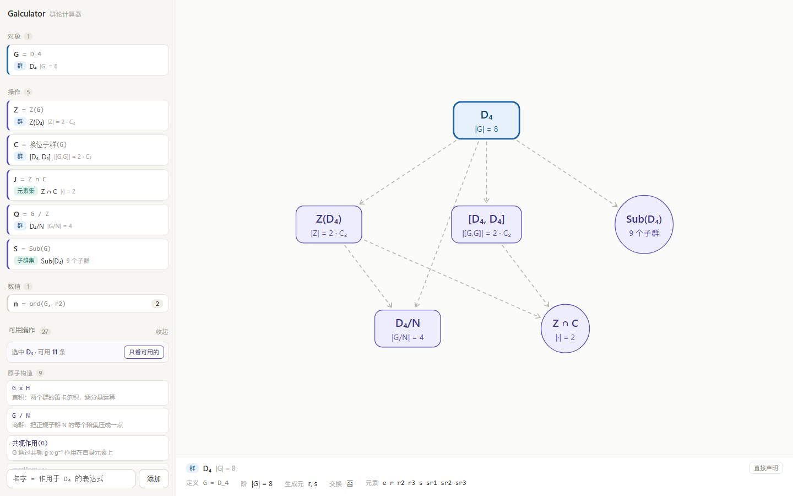
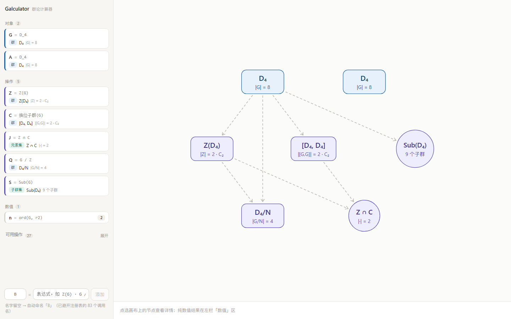
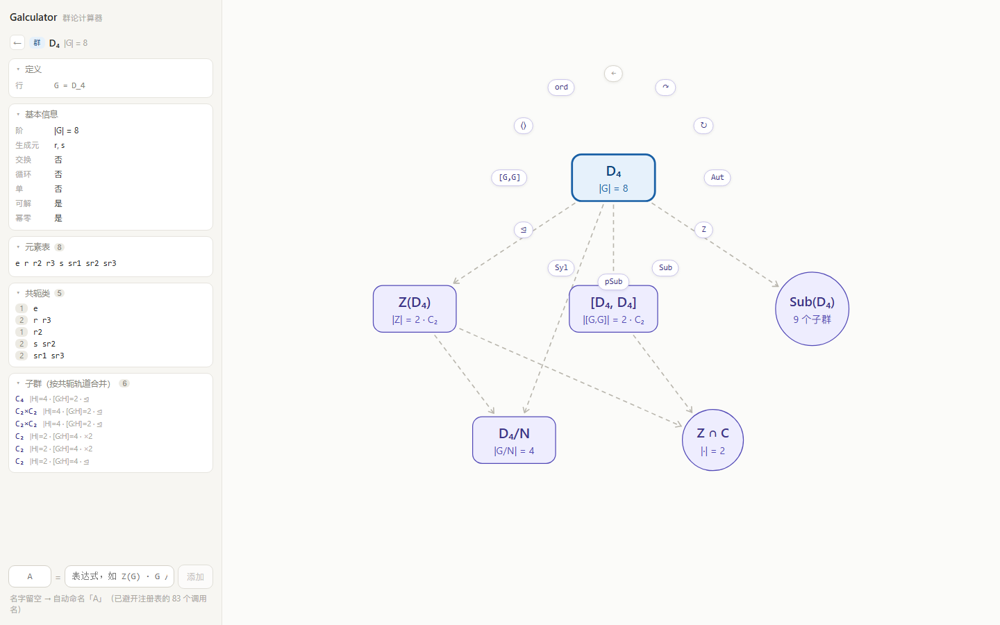
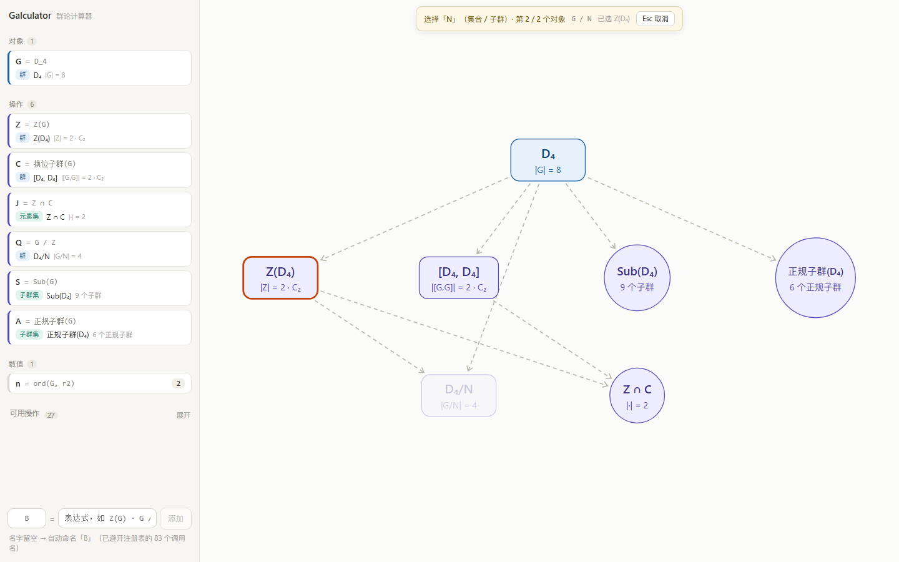

# Galculator — 群论计算器

> 交互式「计算 + 证明可见化」工具。对标 Desmos / GeoGebra 的成熟度，填补群论领域缺失的"计算器"。


_（M0.5 截图：`G = D_4` → `Z(G)` / `G / Z` / `Sub(G)` / `共轭作用(G)` → `轨道(A, r)`，画布自动派生交换图）_

## 为什么做

- Desmos / GeoGebra 擅长实函数与几何，但市面上**没有群论计算器**。
- 群论抽象、难入门；Sylow 定理等证明人人会背，却没人真正"看见"论证如何展开。

## 定位

- **证明可见化器**：演示性证明（模板人工写、机器在具体群上实例化 + 可视化），非形式化证明。
- MVP：**通过群作用证明 Sylow 定理**（I / II / III 三份模板）。
- 三档参照：

| 参照 | 借什么 |
|---|---|
| **Desmos / GeoGebra** | 交互即时反馈（目标体验）。但画布角色相反：它们是**输出**，本项目的画布是**操作台** |
| **Group Explorer** | 群论可视化约定（Cayley 图 / 群作用）|
| **Lean / Coq** | —— **明确不碰**。形式化是另一个宇宙的工程 |

## 技术栈

| 层 | 选型 |
|---|---|
| 前端 | React 19 + TypeScript + Vite（pnpm monorepo，`apps/web`）|
| 引擎 | `@groupviz/core` + `@groupviz/react` **v2.3.0**（npm 包，零 alias）|
| 证明引擎 | Proof Spec（自研，见 [docs/PROOF_SPEC.md](docs/PROOF_SPEC.md)）|
| 计算后端 | GAP（**推迟接入**；`@groupviz/core` 已含 Sylow I 全部原语，小群前端即够）|
| 数学渲染 | KaTeX |

## 快速开始

```bash
pnpm install
pnpm dev          # → http://127.0.0.1:5273
```

在左栏输入一行定义，画布自动长出节点。**输入框是两块**——名字留空即**自动命名**（`A B D F …`，避开注册表的 83 个调用名），
表达式栏**边打边校验**：合法当场显示"会产出什么"，非法红字 + 定向提示。

**操作就在对象旁边**：点画布上的节点 → 旁边冒出 `◎` → 展开三类两层菜单：

| 类 | 行为 |
|---|---|
| **看** | 打开左栏**竖卡**（基本信息 / 元素表 / 共轭类 / 子群按共轭轨道合并 / 识别）——不产生对象 |
| **算** | 一元操作，**点一下直接长出对象**（自动命名，`Z` `Sub` `pSub` `Syl` `⊴` `[G,G]` `Aut`…）|
| **造** | 多元操作，进入**待选**，再点别的节点凑参数（`G×H` `G/N` `A∩B` `C_G` `N_G`…）|

点出来的操作会被**编回一行文本**再交给同一个求值器——所以左栏会真的多出一行（可读可改），
且"点出来的"与"打出来的"行为必然一致。

菜单内容来自注册表（[`src/gal/ops.ts`](apps/web/src/gal/ops.ts)，27 条，按机制分组），每条声明**命名参数 + 类型**；
`opsFor(selection)` 据此派生出"选中什么能做什么"。文本入口照旧可用，下表是全部可写的记法：

| 输入 | 机制 | 产物 |
|---|---|---|
| `G = D_4` | 记号建群 | 群节点（方，蓝）|
| `P = G x H` · `Q = G / Z` | 原子构造（直积 / 商群）| 群节点（方，紫）|
| `A = 共轭作用(G)` | 原子构造（作用）| 作用节点（绿虚线方）+ **作用线** |
| `Z = Z(G)` · `Cg = [G,G]` · `N_G(G, H)` | 作用导出（子群）| **群节点（方，紫）**——子群升级为真群对象，故 `Z(Z(G))` 合法 |
| `I = A ∩ B` · `A ∪ B` · `A \ B` · `A · B` | 原子构造（集合运算）| 集合节点（圆，紫，不自动升级为群）|
| `K = ⟨S⟩` · `⟨G, r2⟩` | 迭代（闭包）| **群节点（方，紫）**|
| `ker(f)` · `im(f)` | 作用导出（映射侧）| 群节点（方，紫）|
| `O = 轨道(A, r)` · `St = 稳定子(A, r)` · `Fix(A)` | 作用导出（原语）| 集合节点（圆，紫）|
| `S = Sub(G)` · `pSub(G, 2)` · `Syl(G, 2)` | 枚举 + 筛 | **子群集**节点（圆，紫）|
| `n = ord(G, (123))` · `C(12, 4)` · `Cmod(12, 4, 2)` | 属性 / 算术 | **数值**（左栏「数值」区，不上画布）|

元素参数一律走 core 的 `resolveElement`——`id` / `label` / **循环记号**都能命中，所以 `ord(S_4, (123))` 合法。

画布视觉：**形状 = 类型**（群 = 方 / 集合、子群集 = 圆 / 作用 = 虚线方），**颜色 = 来源**（蓝 = 输入 / 紫 = 运算 / 绿 = 作用），
淡虚线 = 来源线，实线 + ↷ = 作用线。规则见 [docs/INTERACTION.md](docs/INTERACTION.md) §10。

## 项目结构

```
apps/web/            Vite + React 19 + TS 前端
  src/gal/
    value.ts         6 种值类型 + 子群归一化
    ops.ts           操作注册表（机制 / 命名参数 + 类型 / opsFor / 配方 / 求值）
    naming.ts        自动命名 + 名字体检（保留名从注册表自动导出）
    compose.ts       操作 + 实参 → 定义行（径向菜单的执行路径）
    interaction.ts   画布交互状态机 + 算/造二分（纯状态，可单测）
    evalDef.ts       五级分发求值（引用 → 调用 → 中缀 → 记号）
    build.ts         定义行 → 对象表（纯函数）
    derive.ts        对象表 → 画布图
  src/ui/
    InputPanel.tsx   左栏：三区 + 操作面板 + 两块输入框
    Inspector.tsx    左栏详情态（竖卡）
    CanvasView.tsx   SVG 交换图画布（自绘布局 + 上报节点坐标）
    RadialMenu.tsx   对象旁边的三类两层菜单
docs/                设计 / 架构 / 交互 / 证明 / 规划文档
```

## 项目状态

- **M0 已完成**：对象与操作的输入输出跑通。
- **M0.5 已完成**：操作层走注册表，值类型扩到 6 种，作用线与子群集上画布。
- **U0 已完成**：注册表 27 条全部声明**命名参数 + 类型**，`opsFor(selection)` 落地；集合运算（∩ ∪ \ ·）与闭包
  `⟨S⟩` 可用；`Z(G)` / `[G,G]` / `C_G` / `N_G` / `ker` / `im` / `⟨S⟩` **升级为真群对象**（画布上圆变方）；
  `ker` / `im` 引擎侧就位；左栏操作面板随选中对象收敛。
- **U1 已完成**：输入框拆「名字 \| 表达式」两块，名字留空即自动命名（保留名清单**从注册表自动导出**，
  83 个调用名一个不撞）；表达式栏边打边校验（复用求值器，预览即所得）；重名**拦**、命中操作名**只提醒**。
- **U2 已完成**：交互状态机（`idle → selected → menu → pending / fill`）+ 径向菜单（看 / 算 / 造三类两层）+
  一键执行（编回文本走同一求值器）+ 左栏详情态**竖卡**；`pending` 四件反馈（提示条 / 十字光标 / 已选高亮 / 不可点变暗）。
- 验证：`tsc` 零错误 · U0 **52/52** + U1 **35/35** + U2 **72/72** 断言 · 真浏览器控制台零错误。
- **规划已收敛**（[INTERACTION](docs/INTERACTION.md) v2 + [ROADMAP](docs/ROADMAP.md) 的 U0–U7）：5 条决策已定。
- 下一步 **U3**：映射构建器（生成元填像）——交换图上第一条**实线箭头**；`ker` / `im` 随之自动可用。



_（U0 截图：`G = D₄` → `Z(G)` / `[G,G]` / `Z ∩ C` / `G / Z` / `Sub(G)`。形状编码类型——`Z(D₄)` 与 `[D₄,D₄]` 是**方**（群对象），`Z ∩ C` 是**圆**（集合））_



_（U1 截图：名字栏 `placeholder` 显示将分配的名字；下方提示已避开 83 个调用名）_



_（U2 截图：点 `D₄` → `◎` → 「算」展开 11 个操作环绕在节点旁；左栏已是竖卡（定义 / 基本信息 / 元素表 / 共轭类 / 子群））_



_（U2 截图：`Z(D₄)` 的「造」→ 点 `/` → 顶部「选择「N」（集合 / 子群）· 第 2 / 2 个对象」，其余节点变暗）_

## 文档导航

| 文档 | 内容 |
|---|---|
| [docs/ARCHITECTURE.md](docs/ARCHITECTURE.md) | 内核架构：值类型 / 10 原语 / 60+ 操作清单 / 引擎依赖 / 契约索引 |
| [docs/INTERACTION.md](docs/INTERACTION.md) | **UI 规范 v2**：操作入口（`opsFor` + 径向菜单）/ 输入层 / 集合构造器 / 画布图 / 布局 |
| [docs/PROOF_SPEC.md](docs/PROOF_SPEC.md) | Proof Spec 规范（证明模板 schema + Sylow I 实例）|
| [docs/ROADMAP.md](docs/ROADMAP.md) | 规划：UI 重构线 U0–U7 + 里程碑 M0–M4 |
| [docs/archive/](docs/archive/) | 已完成使命的历史文档（交接 prompt / 早期规划稿）|
